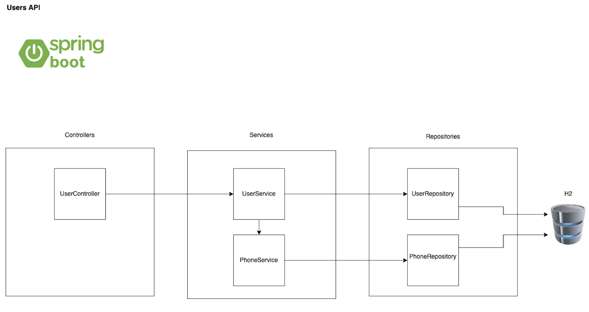

# smartjobs-test-backend

## Solution Diagram.

Here is the solution diagram of the project:

## Run test and show jacoco report
`
mvn test jacoco:report
`

## Run application
`
mvn spring-boot:run
`

## Postman test
To test in local, you can import the following Postman [collection.](postman/Test SmartJobs.postman_collection.json)

## Swagger test
To test on the web, enter the following link
`
http://localhost:8080/swagger-ui/index.html
` in a browser

